# 🚀 CI/CD Pipeline Documentation

## Overview

The Spotify Insights project implements a comprehensive CI/CD pipeline using GitHub Actions, providing automated testing, quality assurance, security scanning, and deployment capabilities.

## Pipeline Architecture

```mermaid
graph TD
    A[Code Push/PR] --> B[🔍 CI Workflow]
    B --> C[🧪 Tests]
    B --> D[🔍 Linting]
    B --> E[🏗️ Build]
    B --> F[🔒 Security]
    
    C --> G[✅ Quality Gate]
    D --> G
    E --> G
    F --> G
    
    G --> H{Main Branch?}
    H -->|Yes| I[🚀 Deploy Workflow]
    H -->|No| J[End]
    
    I --> K[📋 Pre-deploy Checks]
    K --> L[🏗️ Production Build]
    L --> M[🌐 Deploy to Netlify]
    M --> N[🧪 Post-deploy Tests]
    N --> O[📢 Notifications]
    
    P[🏷️ Release Tag] --> Q[🏷️ Release Workflow]
    Q --> R[✅ Validation]
    R --> S[📋 Changelog]
    S --> T[🚀 Create Release]
    T --> U[🚀 Auto Deploy]
```



## Workflows

### 1. 🔍 Continuous Integration (`ci.yml`)

**Triggers:**
- Push to `main` or `develop` branches
- Pull requests to `main` or `develop` branches
- Manual dispatch

**Jobs:**

#### 🧪 Test Suite
- Runs all unit tests (`144/146 passing`)
- Generates coverage reports
- Uploads coverage to Codecov
- **Timeout:** 10 minutes

#### 🔍 Code Quality
- ESLint linting
- TypeScript type checking
- **Timeout:** 5 minutes

#### 🏗️ Build Application
- Matrix build (production & development)
- Environment variable validation
- Artifact upload for downstream jobs
- **Timeout:** 10 minutes

#### 🔒 Security Scan
- NPM security audit
- Vulnerability assessment with `audit-ci`
- **Timeout:** 5 minutes

#### 🔍 Dependency Review
- Reviews new dependencies in PRs
- Checks for known security issues
- Validates license compatibility

#### 🌐 End-to-End Tests
- Full Playwright test suite
- Production build verification
- Test result artifacts on failure
- **Timeout:** 15 minutes

#### ⚡ Performance Audit
- Lighthouse CI performance testing
- Core Web Vitals monitoring
- Performance regression detection
- **Only runs on PRs**

#### ✅ Quality Gate
- Aggregates all job results
- Enforces quality standards
- Provides detailed status reporting

### 2. 🚀 Deployment (`deploy.yml`)

**Triggers:**
- Push to `main` branch
- Release publication
- Manual dispatch with environment selection

**Jobs:**

#### ✅ Pre-deployment Quality Check
- Verifies CI workflow passed
- Checks commit status
- Prevents deployment of broken code

#### 🏗️ Build for Deployment
- Production-optimized build
- Bundle size analysis
- Environment-specific configuration
- Build artifact retention (30 days)

#### 🌐 Deploy to Netlify
- Production deployment to Netlify
- Deployment URL capture
- Environment-based deployments
- Deployment message with commit SHA

#### 🧪 Post-deployment Tests
- Smoke tests against live site
- Basic performance validation
- Health check verification

#### 📢 Notifications
- Success/failure notifications
- Deployment summary
- Live site URL sharing

### 3. 🏷️ Release Management (`release.yml`)

**Triggers:**
- Version tags (e.g., `v2.1.0`)
- Manual dispatch with version input

**Jobs:**

#### ✅ Release Validation
- Full test suite execution
- Build verification
- Version format validation

#### 🏷️ Release Creation
- Automated changelog generation
- Version bumping in package.json
- GitHub release creation
- Release asset building

#### 🚀 Automated Deployment
- Triggers deployment workflow
- Production environment targeting
- Release-specific deployment

## Environment Variables

### Required Secrets

```bash
# Spotify API Configuration
VITE_SPOTIFY_CLIENT_ID=your_spotify_client_id
VITE_SPOTIFY_REDIRECT_URI=https://your-domain.com/callback

# Deployment Configuration
NETLIFY_AUTH_TOKEN=your_netlify_token
NETLIFY_SITE_ID=your_netlify_site_id

# Optional
VITE_API_URL=your_api_endpoint
```

### Environment Variables

```bash
# Development
NODE_VERSION=20
VITE_USE_DUMMY_DATA=true

# Production
VITE_ENVIRONMENT=production
```

## Quality Standards

### Test Coverage Requirements
- **Minimum:** 95% test pass rate
- **Current:** 98.6% (144/146 tests passing)
- **Coverage:** Unit, Integration, E2E, Component tests

### Performance Benchmarks
- **Lighthouse Performance:** 80+
- **Lighthouse Accessibility:** 90+
- **Lighthouse Best Practices:** 90+
- **Lighthouse SEO:** 80+
- **First Contentful Paint:** <2s
- **Largest Contentful Paint:** <4s
- **Cumulative Layout Shift:** <0.1
- **Total Blocking Time:** <300ms

### Security Standards
- **Dependency Auditing:** Moderate level
- **Vulnerability Scanning:** Automated
- **License Compliance:** Automated checking
- **Security Headers:** Netlify defaults + custom

## Deployment Environments

### Production
- **URL:** `https://spotify-insights.netlify.app`
- **Branch:** `main`
- **Auto-deploy:** Yes (after CI passes)
- **Manual approval:** Not required

### Staging
- **URL:** Manual deployment target
- **Branch:** Any (manual trigger)
- **Auto-deploy:** No
- **Manual approval:** Required

## Monitoring & Observability

### Build Monitoring
- **GitHub Actions status badges**
- **Build time tracking**
- **Artifact size monitoring**
- **Performance regression detection**

### Deployment Monitoring
- **Post-deployment health checks**
- **Smoke test automation**
- **Error tracking integration**
- **Performance monitoring**

## Development Workflow

### Feature Development
1. Create feature branch from `develop`
2. Implement changes with tests
3. Push commits (triggers CI)
4. Create PR to `develop`
5. CI validates changes
6. Code review process
7. Merge to `develop`
8. Deploy to staging (optional)

### Release Process
1. Merge `develop` to `main`
2. Create release tag (`v2.1.0`)
3. Release workflow activates
4. Automated changelog generation
5. GitHub release creation
6. Production deployment
7. Post-release validation

### Hotfix Process
1. Create hotfix branch from `main`
2. Implement critical fix
3. Fast-track CI validation
4. Deploy to production
5. Backport to `develop`

## Troubleshooting

### Common Issues

#### CI Failures
```bash
# Check test failures
npm run test:run

# Check linting issues
npm run lint

# Check build issues
npm run build
```

#### Deployment Failures
```bash
# Verify environment variables
echo $VITE_SPOTIFY_CLIENT_ID

# Check build artifacts
ls -la dist/

# Validate Netlify configuration
netlify status
```

#### Performance Issues
```bash
# Run local performance audit
npm install -g lighthouse
lighthouse http://localhost:3000 --view

# Check bundle size
npm run build
npx bundlesize
```

## Best Practices

### Commit Messages
- Use conventional commits format
- Include scope when relevant
- Reference issue numbers

```bash
feat(auth): implement OAuth2 PKCE flow
fix(dashboard): resolve loading state bug
docs(readme): update installation instructions
```

### Branch Protection
- `main` branch requires:
  - ✅ CI checks passing
  - ✅ Up-to-date branches
  - ✅ Code review approval
  - ❌ Direct pushes disabled

### Security
- Automated security scanning
- Secret management through GitHub Secrets
- Environment variable validation

## Performance Optimization

### Build Optimization
- Tree shaking enabled
- Code splitting configured
- Asset optimization
- Bundle analysis

### Deployment Optimization
- CDN distribution via Netlify
- Gzip compression enabled
- Cache headers optimized
- Progressive loading strategies

## Future Enhancements

### Planned Improvements
- [ ] Integration with external monitoring tools
- [ ] Advanced performance budgets
- [ ] Multi-environment staging
- [ ] Canary deployment strategy
- [ ] Advanced security scanning
- [ ] Visual regression testing

### Monitoring Integrations
- [ ] Sentry error tracking
- [ ] Datadog performance monitoring
- [ ] New Relic APM
- [ ] Custom metrics dashboard

## Support

### Getting Help
- **Documentation:** This file and related docs
- **Issues:** GitHub Issues for bug reports
- **Discussions:** GitHub Discussions for questions
- **Team:** Contact the Spotify Insights team

### Useful Commands
```bash
# Run CI locally
npm run test:run && npm run lint && npm run build

# Deploy manually
npm run build && netlify deploy --prod

# Check workflow status
gh workflow list
gh run list --workflow=ci.yml

# Create release
gh release create v2.1.0 --generate-notes
``` 