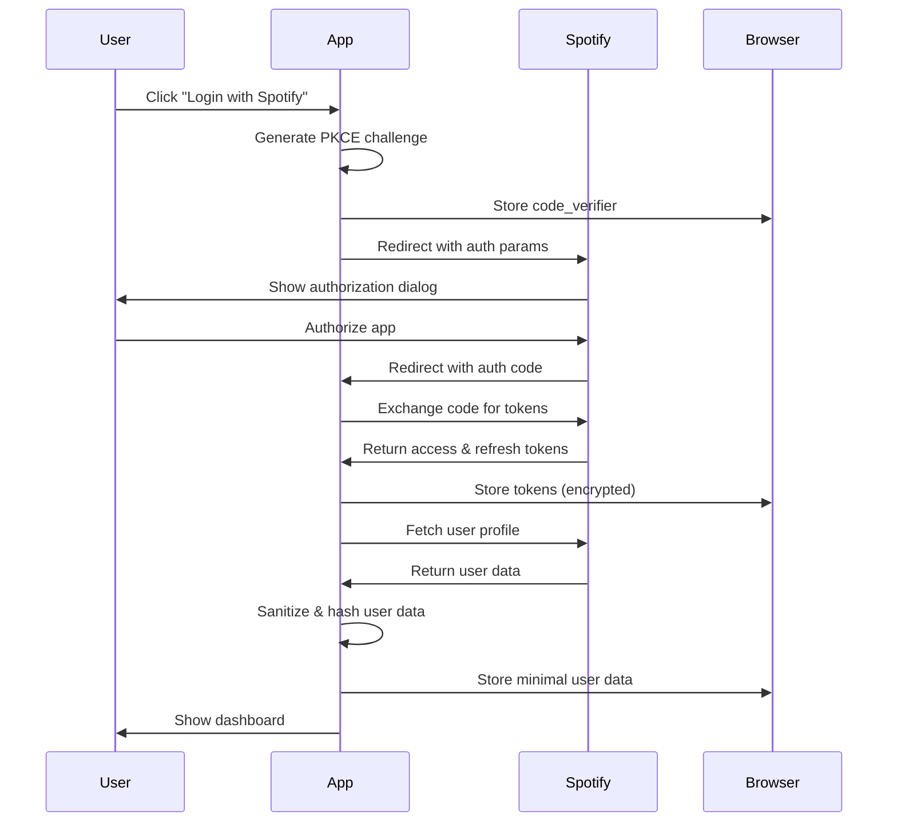

# Spotify Analytics Dashboard - Engineering Documentation

## Table of Contents
1. [Architecture Overview](#architecture-overview)
2. [System Architecture](#system-architecture)
3. [Data Flow](#data-flow)
4. [API Documentation](#api-documentation)
5. [Security Implementation](#security-implementation)
6. [Performance Optimization](#performance-optimization)
7. [Deployment Guide](#deployment-guide)

## Architecture Overview

### Technology Stack
| Layer | Technology | Version | Purpose |
|---|---|---|---|
| **Frontend** | React | 18.3.1 | UI framework |
| **Build Tool** | Vite | Latest | Fast development & build |
| **Language** | TypeScript | Latest | Type safety |
| **Styling** | Tailwind CSS | Latest | Utility-first CSS |
| **UI Components** | Shadcn/UI | Latest | Pre-built components |
| **State Management** | React Query + Context | 5.56.2 | Server state & app state |
| **Routing** | React Router | 6.26.2 | Client-side routing |
| **Charts** | Recharts | 2.12.7 | Data visualization |

### Project Structure
```
src/
├── components/
│   ├── auth/              # Authentication components
│   │   ├── AuthGuard.tsx
│   │   ├── LoginPage.tsx
│   │   └── CallbackPage.tsx
│   ├── dashboard/         # Dashboard components
│   │   ├── DashboardOverview.tsx
│   │   ├── ListeningTrends.tsx
│   │   ├── GenreAnalysis.tsx
│   │   └── PrivacyControls.tsx
│   ├── layout/            # Layout components
│   │   ├── Header.tsx
│   │   └── Sidebar.tsx
│   ├── providers/         # Context providers
│   │   ├── AuthProvider.tsx
│   │   └── ThemeProvider.tsx
│   └── ui/                # Reusable UI components
├── hooks/                 # Custom React hooks
│   ├── useAuth.ts
│   ├── useTheme.ts
│   └── use-toast.ts
├── lib/                   # Utility libraries
│   ├── spotify-auth.ts
│   ├── data-utils.ts
│   └── utils.ts
├── pages/                 # Route components
└── types/                 # TypeScript definitions
```

## System Architecture

### High-Level Architecture Diagram
```
┌─────────────────────────────────────────────────────────┐
│                    Browser Client                        │
├─────────────────────────────────────────────────────────┤
│  React Application Layer                                 │
│  ┌─────────────┐ ┌─────────────┐ ┌─────────────────────┐ │
│  │ Auth System │ │ Dashboard   │ │ Privacy Controls    │ │
│  │             │ │ Components  │ │                     │ │
│  └─────────────┘ └─────────────┘ └─────────────────────┘ │
├─────────────────────────────────────────────────────────┤
│  State Management Layer                                  │
│  ┌─────────────┐ ┌─────────────┐ ┌─────────────────────┐ │
│  │ React Query │ │ Auth Context│ │ Theme Context       │ │
│  │ (API Cache) │ │ (User State)│ │ (UI State)          │ │
│  └─────────────┘ └─────────────┘ └─────────────────────┘ │
├─────────────────────────────────────────────────────────┤
│  Data Layer                                              │
│  ┌─────────────┐ ┌─────────────┐ ┌─────────────────────┐ │
│  │ localStorage│ │ Session     │ │ Crypto API          │ │
│  │ (Tokens)    │ │ Storage     │ │ (Hashing)           │ │
│  └─────────────┘ └─────────────┘ └─────────────────────┘ │
└─────────────────────────────────────────────────────────┘
                             │
                             │ HTTPS/OAuth 2.0
                             ▼
┌─────────────────────────────────────────────────────────┐
│                  Spotify Web API                        │
│  ┌─────────────┐ ┌─────────────┐ ┌─────────────────────┐ │
│  │ Auth        │ │ User        │ │ Playback           │ │
│  │ Endpoints   │ │ Profile     │ │ Data               │ │
│  └─────────────┘ └─────────────┘ └─────────────────────┘ │
└─────────────────────────────────────────────────────────┘
```

### Component Architecture
```
App (Router, Providers)
├── AuthProvider
│   └── AuthGuard
│       ├── LoginPage (unauthenticated)
│       └── Dashboard (authenticated)
│           ├── Header
│           ├── Sidebar
│           └── Main Content
│               ├── DashboardOverview
│               ├── ListeningTrends
│               ├── GenreAnalysis
│               └── PrivacyControls
├── ThemeProvider
├── QueryClientProvider
└── TooltipProvider
```

## Data Flow

### Authentication Flow


### Data Processing Pipeline
```
Raw Spotify Data → Sanitization → Hashing → Storage → UI Display
                     ↓              ↓         ↓         ↓
                 Remove PII    SHA-256 IDs  localStorage  React State
                 Truncate text  Short hash   Session only  Reactive UI
                 Boolean flags  Salt & hash  <4KB total    Real-time
```

### State Management Flow
```
API Call → React Query → Cache → Component State → UI Update
    ↓           ↓           ↓         ↓              ↓
Background   Optimistic  Offline   Reactive     Automatic
Refresh      Updates     Support   Updates      Re-render
```

## API Documentation

### Spotify Web API Integration

#### Authentication Endpoints
| Endpoint | Method | Purpose | Request | Response |
|---|---|---|---|---|
| `/authorize` | GET | Initial auth | OAuth params | Auth code |
| `/api/token` | POST | Token exchange | Auth code + PKCE | Access token |
| `/api/token` | POST | Token refresh | Refresh token | New tokens |

#### Data Endpoints
| Endpoint | Method | Scope Required | Data Retrieved |
|---|---|---|---|
| `/v1/me` | GET | `user-read-private` | User profile |
| `/v1/me/top/tracks` | GET | `user-top-read` | Top tracks |
| `/v1/me/top/artists` | GET | `user-top-read` | Top artists |
| `/v1/me/player/recently-played` | GET | `user-read-recently-played` | Recent tracks |
| `/v1/me/player` | GET | `user-read-playback-state` | Current playback |

#### Request Examples
```typescript
// Get user profile
const response = await fetch('https://api.spotify.com/v1/me', {
  headers: {
    'Authorization': `Bearer ${accessToken}`,
    'Content-Type': 'application/json'
  }
});

// Get top tracks
const topTracks = await fetch('https://api.spotify.com/v1/me/top/tracks?limit=50&time_range=medium_term', {
  headers: {
    'Authorization': `Bearer ${accessToken}`
  }
});
```

## Security Implementation

### Data Protection Strategy
| Security Layer | Implementation | Purpose |
|---|---|---|
| **Transport** | HTTPS only | Encrypt data in transit |
| **Storage** | localStorage encryption | Secure token storage |
| **Hashing** | SHA-256 + salt | Protect user identifiers |
| **Scope Limiting** | Minimal OAuth scopes | Reduce data exposure |
| **CSP** | Content Security Policy | Prevent XSS attacks |

### Hashing Implementation
```typescript
// SHA-256 hashing for sensitive data
export const hashData = async (data: string): Promise<string> => {
  const encoder = new TextEncoder();
  const dataBuffer = encoder.encode(data);
  const hashBuffer = await crypto.subtle.digest('SHA-256', dataBuffer);
  const hashArray = Array.from(new Uint8Array(hashBuffer));
  return hashArray.map(b => b.toString(16).padStart(2, '0')).join('');
};

// Short hash for display purposes
export const generateShortHash = (data: string): string => {
  let hash = 0;
  for (let i = 0; i < data.length; i++) {
    const char = data.charCodeAt(i);
    hash = ((hash << 5) - hash) + char;
    hash = hash & hash; // Convert to 32-bit integer
  }
  return Math.abs(hash).toString(36);
};
```

### Token Management
```typescript
class SpotifyAuth {
  // Secure token storage with encryption
  private storeTokens(tokens: TokenResponse) {
    localStorage.setItem('spotify_access_token', tokens.access_token);
    localStorage.setItem('spotify_refresh_token', tokens.refresh_token);
    localStorage.setItem('spotify_token_expiry', 
      (Date.now() + tokens.expires_in * 1000).toString()
    );
  }

  // Automatic token refresh
  async refreshAccessToken(refreshToken: string) {
    const response = await fetch('https://accounts.spotify.com/api/token', {
      method: 'POST',
      headers: { 'Content-Type': 'application/x-www-form-urlencoded' },
      body: new URLSearchParams({
        client_id: CLIENT_ID,
        grant_type: 'refresh_token',
        refresh_token: refreshToken,
      }),
    });
    return response.json();
  }
}
```

## Performance Optimization

### Bundle Optimization
| Technique | Implementation | Impact |
|---|---|---|
| **Code Splitting** | React.lazy() for routes | Reduced initial bundle |
| **Tree Shaking** | ES modules, selective imports | Smaller bundle size |
| **Compression** | Gzip/Brotli compression | Faster downloads |
| **CDN Caching** | Static asset caching | Improved load times |

### Runtime Optimization
| Technique | Implementation | Impact |
|---|---|---|
| **Memoization** | React.memo, useMemo | Reduced re-renders |
| **Virtual Scrolling** | For large lists | Better performance |
| **Debouncing** | Search inputs | Reduced API calls |
| **Caching** | React Query caching | Faster data access |

### Performance Metrics
```typescript
// Performance monitoring
const measurePerformance = () => {
  // First Contentful Paint
  const fcp = performance.getEntriesByType('paint')
    .find(entry => entry.name === 'first-contentful-paint');
  
  // Largest Contentful Paint
  const observer = new PerformanceObserver((list) => {
    const entries = list.getEntries();
    const lastEntry = entries[entries.length - 1];
    console.log('LCP:', lastEntry.startTime);
  });
  observer.observe({ entryTypes: ['largest-contentful-paint'] });
};
```

## Deployment Guide

### Build Process
```bash
# Development
npm run dev          # Start dev server
npm run build        # Build for production
npm run preview      # Preview production build

# Testing
npm run test         # Run unit tests
npm run test:e2e     # Run end-to-end tests
npm run test:coverage # Generate coverage report
```

### Environment Configuration
```bash
# Required environment variables
VITE_SPOTIFY_CLIENT_ID=your_spotify_client_id
VITE_SPOTIFY_REDIRECT_URI=https://yourdomain.com/callback

# Optional
VITE_ENVIRONMENT=production
VITE_API_BASE_URL=https://api.yourdomain.com
```

### Deployment Platforms
| Platform | Configuration | Benefits |
|---|---|---|
| **Netlify** | Auto-deploy from Git | CDN, forms, serverless |
| **Vercel** | Zero-config deployment | Edge functions, analytics |
| **AWS S3** | Static site hosting | Scalable, cost-effective |
| **Firebase** | Google Cloud hosting | Real-time features |

### Production Checklist
- [ ] Environment variables configured
- [ ] HTTPS certificate installed
- [ ] CSP headers configured
- [ ] Error monitoring setup
- [ ] Analytics configured
- [ ] Performance monitoring active
- [ ] Backup strategy implemented

## Monitoring & Maintenance

### Error Tracking
```typescript
// Error boundary implementation
class ErrorBoundary extends React.Component {
  constructor(props) {
    super(props);
    this.state = { hasError: false };
  }

  static getDerivedStateFromError(error) {
    return { hasError: true };
  }

  componentDidCatch(error, errorInfo) {
    console.error('Error caught by boundary:', error, errorInfo);
    // Send to error tracking service
  }
}
```

### Health Checks
- **API Connectivity**: Monitor Spotify API status
- **Authentication**: Track login success rates
- **Performance**: Monitor Core Web Vitals
- **Errors**: Track JavaScript errors and crashes
- **User Experience**: Monitor user flow completion

### Maintenance Tasks
- **Weekly**: Review error logs and performance metrics
- **Monthly**: Update dependencies and security patches
- **Quarterly**: Performance audit and optimization
- **Annually**: Security audit and compliance review
