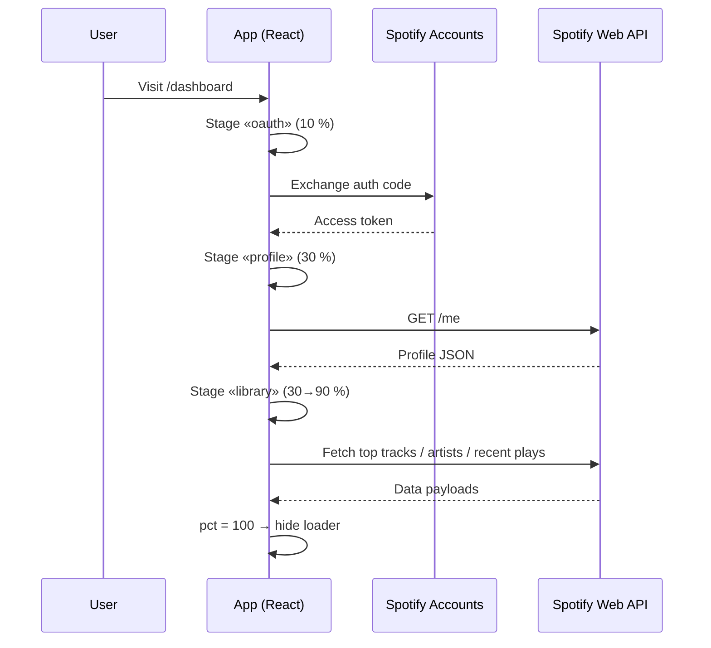
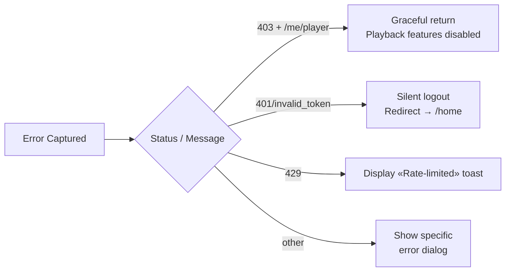
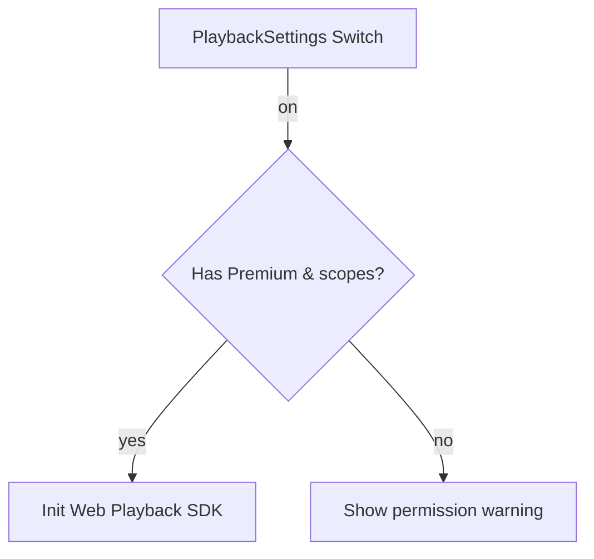

# Spotify Insights – Concise Overview

> **TL;DR** — Everything you need to know about architecture, data-flow, and error-handling in **~5 minutes**.

---

## 1. High-Level Architecture

```mermaid
graph TD
  A[User Browser] --> B[React UI]
  B -->|OAuth 2.0 PKCE| C(Spotify Accounts Service)
  B --> D[Spotify Web API]
  B --> E[Local Data Processing]
  E --> F[In-Browser Cache]
  subgraph Optional – Playback SDK
    B --> G[Spotify Web Playback SDK]
  end
```

**Key Points**
1. **All analytics run in the browser** – raw data never leaves the client.
2. **Optional playback layer** (requires Premium / extra scopes) is fully decoupled.
3. **Caching** lives in `localStorage` to speed up subsequent sessions.

---

## 2. Authentication & Loading Flow



**Loader Stages**
| Stage | Progress | Trigger |
|-------|----------|---------|
| oauth | 10 % | Token exchange starts |
| profile | 30 % | User profile fetched |
| library | 30–90 % | Bulk data queries |
| complete | 100 % | All promises resolved |

---

## 3. Error-Handling Strategy



**Highlights**
- **403 (Playback)** – silently downgrades to analytics-only mode.
- **401** – tokens cleared; user sent to landing page without scary errors.
- **Timeout Guard** – loader auto-dismisses after 30 s with helpful message.

---

## 4. Playback Features Toggle



- Users can enable / disable playback at **Settings → Playback Features**.
- Preference stored in `localStorage` (`enable_playback_features`).

---

## 5. Directory Cheat-Sheet

| Path | Purpose |
|------|---------|
| `src/lib/auth/spotify-auth-core.ts` | OAuth & scope management |
| `src/components/providers/LoadingProvider.tsx` | Global loading context |
| `src/components/ui/GlobalLoader.tsx` | Full-screen loader |
| `src/lib/spotify-api.ts` | Typed wrapper around Web API with graceful errors |
| `src/lib/spotify-playback-manager.ts` | Optional playback SDK bootstrap |

---

## 6. Further Reading

* `AUTHENTICATION_ERROR_FIXES.md` – deep dive into auth edge-cases
* `PLAYBACK_403_FIXES.md` – playback-permission refactor
* `docs/ENGINEERING.md` – coding standards & folder conventions

---

⌛ **Done.** You now have the bird's-eye view – dive into code with confidence! 